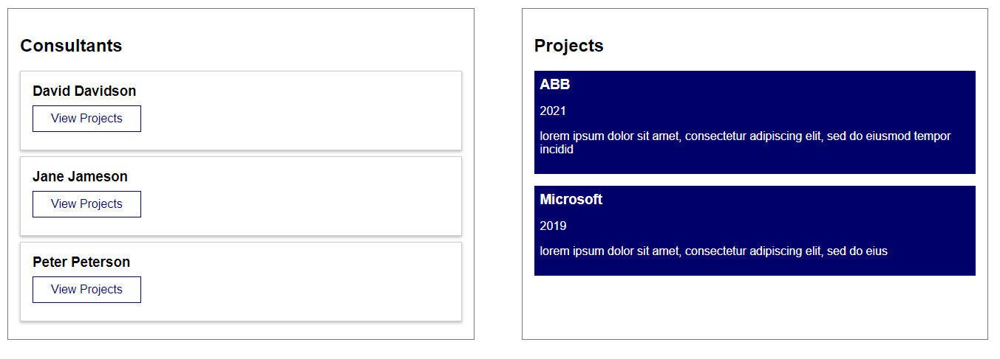

# graphQL front-end example with vue-apollo

This example demonstrates how to access data from the graphql back-end (the accomanying server of [this repo](https://github.com/felixsc1/Database_graphql) must be running locally). The address to the graphql API is specified in main.js and in apollo.config.js.

The app contains just two different queries (specified in ./graphql/queries.js):

- Get the list of all consultants, which will be displayed on the left side.
- When clicking on "View Projects", the corresponding projects of that consultant are queried and displayed on the right.

